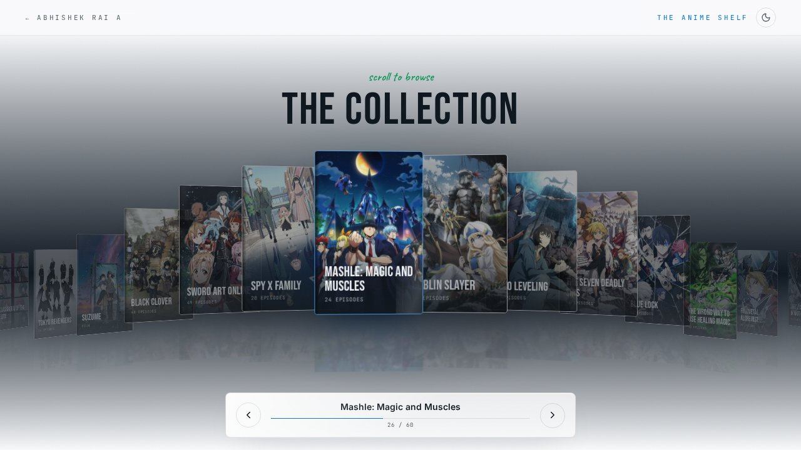

<div align="center">

# Abhi's Anime Shelf

**An interactive record of every anime I've watched — built as a room you walk through, not a table you scroll.**

[Live site](https://abhi-anime-atlas.lovable.app) · [Portfolio](https://portfolio-abhirai2006.lovable.app)



</div>

---

## Overview

Most "anime lists" are spreadsheets with cover art. This one is a physical collection: 60 cases standing on a curved shelf in a dark, lit room. Scrolling moves the shelf past you. Clicking a case pulls it forward and opens it. You can describe a mood and let the shelf answer, roll the dice for a random pick, or leave a recommendation in the one empty slot.

**3,600+ episodes · 60 titles · ~1,450 hours**

## Features

| | |
|---|---|
| **Scroll-driven 3D gallery** | 60 cases travel through a curved perspective arc as the page scrolls, with depth, reflections, lighting glints and a colour aura pulled from each cover. |
| **Physical case design** | Spine colour, thickness, gloss and wear vary by title and run length — a 1,120-episode case looks nothing like a single film. |
| **Case details** | Synopsis, studio, year, genres, format, episodes watched, viewing time, and that title's share of the whole shelf. |
| **Mood curator** | Describe a feeling in plain language ("something that will wreck me") and get a small, fitting set of titles already on the shelf. |
| **Surprise me** | One click — or the `R` key — pulls a random case off the rack. |
| **Visitor recommendations** | Search a live anime catalogue, add a note, and permanently leave a recommendation in the empty slot. |
| **Dark & light themes** | Both match the portfolio palette, animate with View Transitions, and remember the visitor's choice. |
| **Responsive** | Desktop gets the pinned cinematic scroll scene; mobile gets a native swipe-and-snap gallery. |
| **Accessible** | Keyboard navigation, focus states, semantic controls, and a full reduced-motion alternative. |
| **SEO-ready** | Per-page title/description, Open Graph and Twitter cards, canonical URL, `CollectionPage` + `ItemList` JSON-LD, sitemap and robots. |

## Visual direction

A standalone extension of [Abhi's portfolio](https://portfolio-abhirai2006.lovable.app), carrying over the navy-black room, electric-blue light, green accent, display typography, quiet film grain and precise mono labels.

The gallery controls use a lightweight CSS interpretation of refractive glass, inspired by [`dashersw/liquid-glass-js`](https://github.com/dashersw/liquid-glass-js) (MIT). A WebGL canvas per item was deliberately avoided so cover art stays crisp and scrolling stays smooth on phones.

## Tech stack

- **Framework** — TanStack Start + TanStack Router (SSR, server functions)
- **UI** — React 19, TypeScript, Tailwind CSS 4
- **Backend** — Lovable Cloud (Postgres, row-level security) for persistent recommendations
- **AI** — Lovable AI Gateway (Gemini) for mood curation
- **Data** — [Kitsu](https://kitsu.io/) JSON:API for catalogue search and collection metadata
- **Build** — Vite 7, Bun

## Getting started

```bash
bun install
bun run dev
```

The dev server runs on `http://localhost:8080`.

### Environment

Server-side values, injected automatically inside Lovable:

| Variable | Purpose |
|---|---|
| `SUPABASE_URL` | Backend endpoint |
| `SUPABASE_PUBLISHABLE_KEY` | Public client key |
| `LOVABLE_API_KEY` | AI gateway access for the mood curator |

Never expose these in browser code or commit private credentials.

## Project structure

```text
src/
  components/shelf/
    CurvedShelf.tsx      Scroll-driven 3D gallery (desktop) + swipe carousel (mobile)
    AnimeCase.tsx        Individual case: cover, spine, wear, lighting
    CaseDetail.tsx       Pulled-forward case modal
    RecommendDialog.tsx  Catalogue search + recommendation form
    ThemeToggle.tsx      Dark/light with View Transitions
  data/anime.ts          Typed static collection data and derived totals
  lib/anime.functions.ts Server functions: catalogue search, mood curation, recommendations
  routes/index.tsx       The shelf page and its head metadata
  styles.css             Theme tokens, 3D transforms, glass, motion
public/
  og-cover.jpg           Social share image (1200x630)
  robots.txt, sitemap.xml
```

## Security

- Recommendations are stored behind row-level security: anyone may read visible rows and insert one, nobody can update or delete from the client.
- Insert policy enforces length limits on title, name and note.
- The visitor fingerprint column is excluded from public read access at the column level.
- Server-only secrets are read inside server-function handlers, never in browser code.

## Data and privacy

Watched counts come from my personal list. Visitors may submit a display name and an optional note; both are shown publicly alongside the chosen title. No account is required to browse or recommend.

## Deployment

Hosted on Lovable. Preview in the editor, then **Publish → Update** to ship.

## Credits

- Anime metadata and search — [Kitsu](https://kitsu.io/)
- Refractive glass reference — [liquid-glass-js](https://github.com/dashersw/liquid-glass-js) (MIT)
- Built with [Lovable](https://lovable.dev/)

---

<div align="center">
<sub>Made by <a href="https://portfolio-abhirai2006.lovable.app">Abhishek Rai A</a> · still watching</sub>
</div>
